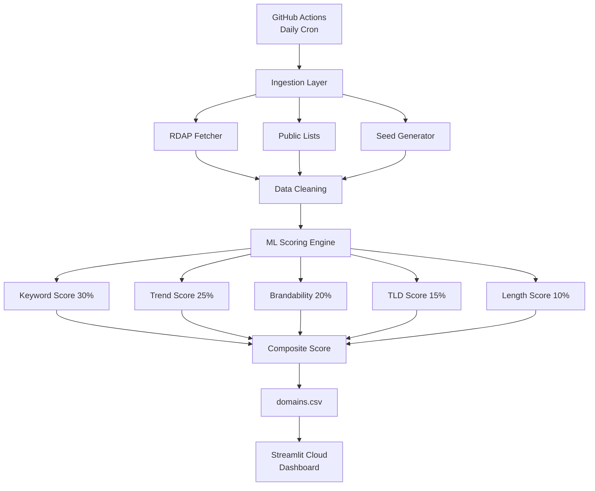

# 🔍 Domain Intelligence App

> AI-powered expiring domain discovery, scoring, and intelligence dashboard.

[](https://github.com/YOUR_USERNAME/domain-intelligence-app/actions)
[](https://YOUR_APP.streamlit.app)

---

## 🎯 What It Does

Domain Intelligence automatically discovers expiring domains globally, scores them using ML/AI, and displays everything on a premium public dashboard.

### Key Features

- **🔄 Automated Discovery**: Daily pipeline discovers expiring domains from multiple free sources
- **🧠 ML Scoring Engine**: Weighted scoring across 5 dimensions (keywords, trends, TLD value, brandability, length)
- **📊 Premium Dashboard**: Dark-themed Streamlit app with interactive charts and filters
- **⏰ Expiry Classification**: Domains sorted by 1-day, 7-day, and 30-day windows
- **💰 Price Estimation**: Heuristic buy-price estimates based on TLD, length, and keywords
- **📥 CSV Export**: Download scored datasets for offline analysis
- **🤖 Fully Automated**: GitHub Actions runs the entire pipeline daily — zero maintenance

---

## 🏗️ Architecture



---

## 📁 Project Structure

```
domain-intelligence-app/
├── app/
│   └── app.py                  # Streamlit dashboard
├── ingestion/
│   ├── rdap_fetcher.py         # RDAP domain expiry lookup
│   ├── public_lists.py         # Public domain list scraper
│   ├── zone_file_parser.py     # Zone file parser
│   └── seed_data.py            # Realistic seed data generator
├── scoring/
│   ├── features.py             # Feature engineering
│   ├── brandability.py         # NLP brandability scoring
│   ├── trend_scorer.py         # Google Trends integration
│   ├── price_estimator.py      # Price estimation
│   └── scorer.py               # Composite scoring engine
├── pipeline/
│   └── run_pipeline.py         # Pipeline orchestrator
├── alerts/
│   └── web_alert.py            # Top opportunities generator
├── utils/
│   ├── config.py               # Central configuration
│   ├── logger.py               # Structured logging
│   └── helpers.py              # Shared utilities
├── data/
│   └── domains.csv             # Scored dataset (auto-updated)
├── .github/workflows/
│   └── daily_pipeline.yml      # Daily cron job
├── .streamlit/
│   └── config.toml             # Theme configuration
├── requirements.txt
├── README.md
└── setup_guide.md
```

---

## 🚀 Quick Start

### 1. Clone & Install

```bash
git clone https://github.com/YOUR_USERNAME/domain-intelligence-app.git
cd domain-intelligence-app
pip install -r requirements.txt
```

### 2. Run Pipeline

```bash
python -m pipeline.run_pipeline
```

### 3. Launch Dashboard

```bash
streamlit run app/app.py
```

---

## 🧠 Scoring System

| Dimension | Weight | What It Measures |
|-----------|--------|-----------------|
| **Keywords** | 30% | Presence of premium industry terms (AI, crypto, cloud, etc.) |
| **Trends** | 25% | Google Trends relevance of domain keywords |
| **Brandability** | 20% | Word composition, phonetics, memorability, brand patterns |
| **TLD Value** | 15% | Commercial tier of TLD (.com > .ai > .io > .net) |
| **Length** | 10% | Shorter domains score higher (3-7 chars ideal) |

**Value Tags:**
- 🟢 **High Value**: Score ≥ 70
- 🟡 **Medium Value**: Score 40-69
- ⚪ **Low Value**: Score < 40

---

## ⚙️ Configuration

All scoring parameters are tunable in `utils/config.py`:
- Scoring weights
- TLD tier scores
- Premium keyword lists
- Price estimation ranges
- Pipeline limits

---

## 📝 License

MIT License — free for personal and commercial use.
