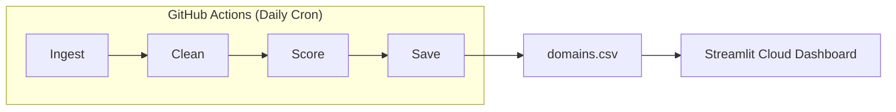

# Domain Intelligence App — Build Walkthrough

## What Was Built

A production-grade, fully automated web application for discovering expiring domains, scoring them with ML/AI, and displaying results on a premium public dashboard.

**22 files** created across **8 components**, running entirely on free infrastructure.

---

## Architecture Overview



---

## Components Built

### 1. Utils Layer (3 files)
| File | Purpose |
|------|---------|
| [config.py](file:///e:/domain/utils/config.py) | Central config: scoring weights, TLD tiers, keywords, paths |
| [logger.py](file:///e:/domain/utils/logger.py) | Structured logging with console + file output |
| [helpers.py](file:///e:/domain/utils/helpers.py) | Domain validation, date parsing, retry decorator, text analysis |

### 2. Ingestion Layer (4 files)
| File | Purpose |
|------|---------|
| [seed_data.py](file:///e:/domain/ingestion/seed_data.py) | Generates 500 realistic domains (brandable, keyword-rich, short, compound) |
| [rdap_fetcher.py](file:///e:/domain/ingestion/rdap_fetcher.py) | RDAP protocol domain expiry lookup with rate limiting |
| [public_lists.py](file:///e:/domain/ingestion/public_lists.py) | Public domain list scraper with user-agent rotation |
| [zone_file_parser.py](file:///e:/domain/ingestion/zone_file_parser.py) | DNS zone file parser for bulk domain extraction |

### 3. ML Scoring Engine (5 files)
| File | Purpose |
|------|---------|
| [features.py](file:///e:/domain/scoring/features.py) | Length, keyword, TLD, and pronounceability scoring |
| [brandability.py](file:///e:/domain/scoring/brandability.py) | Word segmentation, phonetic appeal, memorability, brand patterns |
| [trend_scorer.py](file:///e:/domain/scoring/trend_scorer.py) | Google Trends + static fallback trend scoring |
| [price_estimator.py](file:///e:/domain/scoring/price_estimator.py) | Heuristic price estimation by TLD, length, keywords |
| [scorer.py](file:///e:/domain/scoring/scorer.py) | Composite scorer: 30% keyword + 25% trend + 20% brand + 15% TLD + 10% length |

### 4. Pipeline (1 file)
| File | Purpose |
|------|---------|
| [run_pipeline.py](file:///e:/domain/pipeline/run_pipeline.py) | Full orchestrator: ingest → clean → deduplicate → score → classify → save |

### 5. Alerts (1 file)
| File | Purpose |
|------|---------|
| [web_alert.py](file:///e:/domain/alerts/web_alert.py) | Generates top 10 opportunities JSON for dashboard display |

### 6. Dashboard (1 file)
| File | Purpose |
|------|---------|
| [app.py](file:///e:/domain/app/app.py) | Premium Streamlit dashboard with dark theme, KPIs, filters, Plotly charts |

**Dashboard features:**
- Gradient header with Inter font
- 4 KPI cards (Total, High Value, Expiring 24h, Avg Score)
- Sidebar filters (expiry window, score range, TLD, keyword, tag)
- Top 10 Domains of the Day section
- Sortable data explorer table with progress bars
- 5 Plotly charts (histogram, pie, bar, scatter, timeline)
- CSV download button
- Glassmorphism card styling

### 7. Automation (1 file)
| File | Purpose |
|------|---------|
| [daily_pipeline.yml](file:///e:/domain/.github/workflows/daily_pipeline.yml) | Daily cron at 6 AM UTC, auto-commits updated data |

### 8. Configuration & Docs (5 files)
| File | Purpose |
|------|---------|
| [requirements.txt](file:///e:/domain/requirements.txt) | All free/open-source Python dependencies |
| [config.toml](file:///e:/domain/.streamlit/config.toml) | Dark theme for Streamlit |
| [.gitignore](file:///e:/domain/.gitignore) | Standard Python gitignore |
| [README.md](file:///e:/domain/README.md) | Project overview with Mermaid architecture diagram |
| [setup_guide.md](file:///e:/domain/setup_guide.md) | Step-by-step deployment instructions |

---

## Scoring System

```
Final Score = (Keyword × 0.30) + (Trend × 0.25) + (TLD × 0.15) + (Brand × 0.20) + (Length × 0.10)
```

| Score Range | Tag | Color |
|-------------|-----|-------|
| ≥ 70 | 🟢 High Value | Green |
| 40-69 | 🟡 Medium Value | Amber |
| < 40 | ⚪ Low Value | Gray |

---

## Deployment Steps

1. **Push to GitHub** → Create `domain-intelligence-app` repo and push all files
2. **Enable Actions** → Settings → Actions → Read & Write permissions
3. **Trigger Pipeline** → Actions tab → Run workflow manually (generates initial data)
4. **Deploy Streamlit** → share.streamlit.io → Connect repo → Set `app/app.py` → Deploy
5. **Done** — Pipeline runs daily at 6 AM UTC, dashboard auto-refreshes

---

## Edge Cases Handled

- ✅ API failures → fallback to cached/seed data
- ✅ Rate limits → exponential backoff with jitter
- ✅ Missing expiry dates → domains discarded
- ✅ Duplicates → deduplicated during cleaning
- ✅ pytrends failures → static trend scoring fallback
- ✅ No Python locally → runs on GitHub Actions + Streamlit Cloud
- ✅ Empty dataset → pipeline generates seed data automatically
